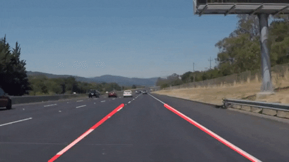

# Lane lines detector

## Overview
The goal of the project is to detect the lane lines of a road from a video recorded from a camera mounted on top of a moving car.

In this repository you will find the following files:

### project_1.ipynb : 
Commented python script for lane detection for both images and videos.

### writeup.md 
Detailed description of all the pipeline that images and videos have to go through in order to correctly detectt the lane lines.

## Demo 

